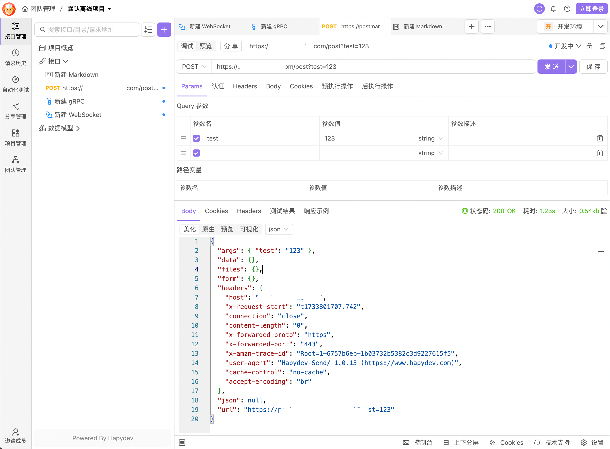
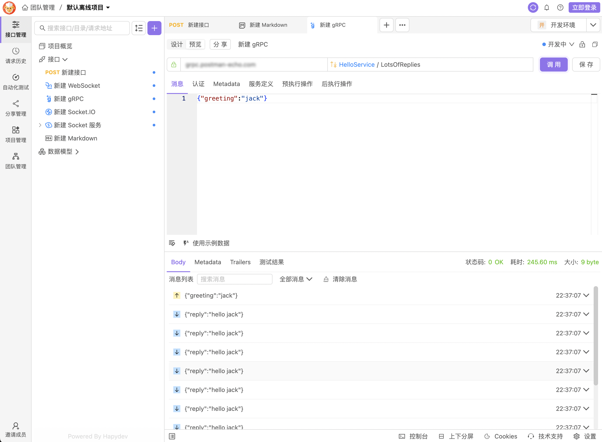
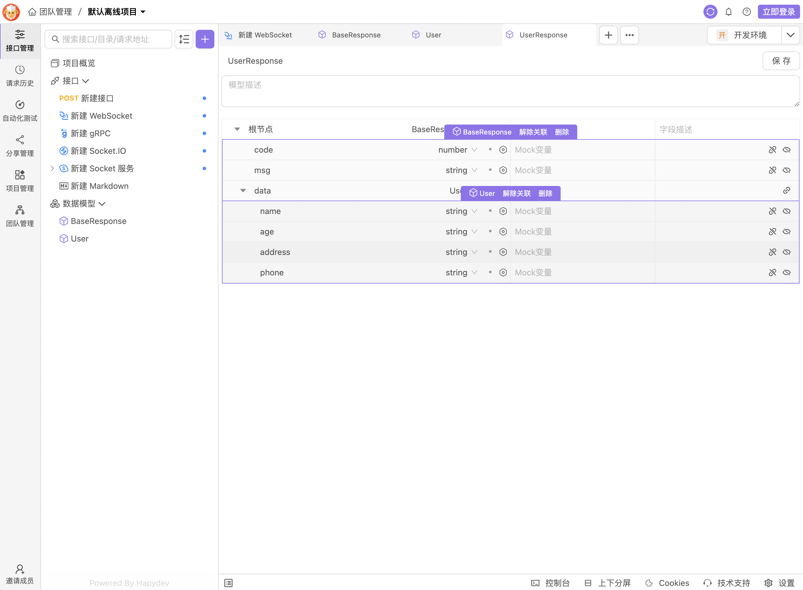
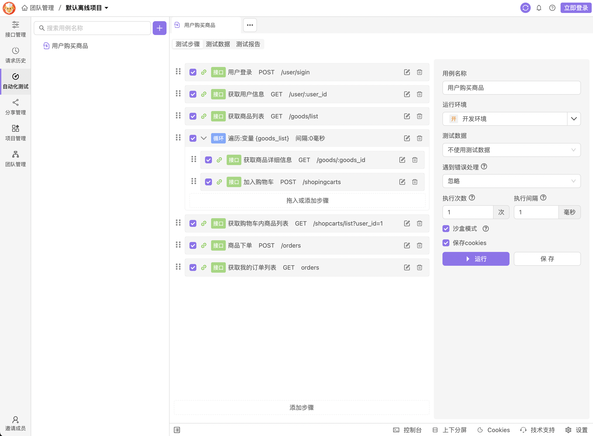

<br />
<p align="center"></p>

## hapydev

一体化API调试工具，跨平台 API 客户端，适用于 HTTP、TCP、UDP、REST、WebSockets、Socket.IO、服务端推送事件 (SSE)、gRPC 等协议。

借助Hapydev,您可以：

- 无需登陆，无需联网可使用软件绝大部分功能。👍️👍️👍️
- 零门槛零代码实现场景复杂的自动化测试。👍️👍️👍️
- 支持grpc一元/二元，单向/双向调用，proto解析，及服务反射等独有功能。👍️👍️👍️
- 快速导入Postman,Swagger,Apifox,Apipost,Eolink等数据
- 使用业内主流的的协议和格式调试 API 。
- 快速定义和预览您设计的 API。
- 对您的接口进行单元测试。
- 使用多种方式与团队内其他人进行协作。
- 专注调试细节,拒绝繁琐操作，输出信息更偏向底层，更精准定位调试问题。

您在Hapydev中的数据，可以通过以下几种方式进行选择：

- 本地数据库：100%存储于您本地，不会传输到云端，保证数据安全
- 公有云服务：用于与团队内部或外部团队人员进行协作，针对不同项目可赋予不同角色人员权限
- 私有云服务：数据存储您企业服务器内部，完全与外网隔绝，满足企业数据安全。

## 快速预览产品

- 产品体验地址
  https://app.hapydev.com/

- HTTP接口调试
<p align="center"></p>

- gRpc接口调试
<p align="center"></p>

- websocket接口调试
<p align="center"></p>

- 支持多次引用的数据模型
<p align="center"></p>

- 支持零代码实现复杂的自动化测试
<p align="center"></p>

- 支持多种个性主题定制
<p align="center"></p>

## 免费开始

- 第1步，安装请求代理

  ```bash
  $ git clone git@github.com:hapydev-team/hapydev-proxy.git
  $ cd hapydev-proxy
  $ npm install
  $ npm start
  ```

- 第2步，安装后端API服务（非必需）

  ```bash
  $ git clone git@github.com:hapydev-team/hapydev-server.git
  $ cd hapydev-server

  #手动配置.env好Mysql,minio,短信等环境变量后，继续运行下方脚本

  $ npm install
  $ npm run gen
  $ npm start
  ```

- 第3步，安装调试应用程序

  ```bash
  $ git clone git@github.com:hapydev-team/hapydev.git
  $ cd hapydev
  $ npm install
  $ npm start
  ```

然后打开浏览器访问 http://127.0.0.1:8000 ,

## 账户和订阅

您可以在未拥有Hapydev账户的情况下使用，也可以创建一个免费账户来使用该产品的全部功能。
即使您有账户，Hapydev仅会将您的项目数据，通过文件碎片的方式存储到云端服务器中，Hapydev无法直接读取您的数据内容。
Hapydev支持您创建的项目数据存储到个人电脑，这种方式不会将数据提交到云端，因此，您可以自由选择敏感项目是否对数据进行上传。
Hapydev提供了数据库连接管理功能，以及私人环境功能，为了增加安全性，您的数据始终是存在本地而不是存储在云中，与您为项目设置的存储选项无关。

## 高级功能和支持

Hapydev开源版与免费版，可以满足大多数企业与个人用户需求，但如果您需要获得更多高级功能，如无限协作，分支管理，为您的项目分配组织的能力，以及使用第三方ID（如SSO/SAML）等其他功能，那么您可以尝试使用其他版本。
点此了解所有版本支持内容。https://www.hapydev.com/price

## Bug 和需求反馈

如果想要反馈 Bug、提供产品意见，可以创建一个 [Github issue](https://github.com/hapydev-team/hapydev/issues) 联系我们，十分感谢！

如果您希望和 Hapydev 团队近距离交流，讨论产品使用技巧以及了解产品最新进展，欢迎加入以下渠道。

- 扫客服小二微信加群：（备注：hapydev技术交流）

<p align="left"></p>
